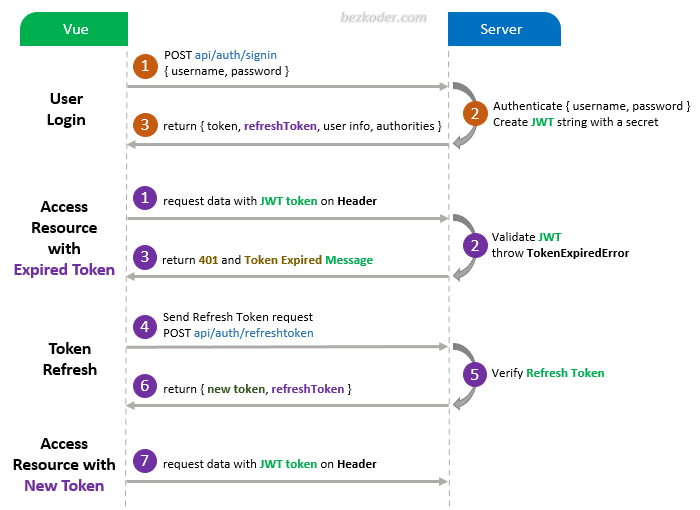

# Vue 3 JWT Refresh Token with Axios example



For instruction, please visit:
> [Vue 3 JWT Refresh Token with Axios example](https://bezkoder.com/vue-3-refresh-token/)

> [Vue 3 Authentication & Authorization with JWT, Vuex and Vue Router](https://bezkoder.com/vue-3-authentication-jwt/)

## Note:
Open `src/services/setupInterceptors.js` and modify `config.headers` for appropriate back-end (found in the tutorial).

```js
instance.interceptors.request.use(
  (config) => {
    const token = TokenService.getLocalAccessToken();
    if (token) {
      // config.headers["Authorization"] = 'Bearer ' + token;  // for Spring Boot back-end
      config.headers["x-access-token"] = token; // for Node.js Express back-end
    }
    return config;
  },
  (error) => {
    return Promise.reject(error);
  }
);
```

Related Posts:
> [Vue 2 JWT Authentication with Vuex and Vue Router](https://bezkoder.com/jwt-vue-vuex-authentication/)

> [Using Typescript](https://bezkoder.com/vuex-typescript-jwt-auth/)

> [Vue 3 CRUD example with Axios and Vue Router](https://bezkoder.com/vue-3-crud/)

Fullstack with Spring Boot Back-end:
> [Spring Boot + Vue.js: Authentication with JWT & Spring Security Example](https://bezkoder.com/spring-boot-vue-js-authentication-jwt-spring-security/)

Fullstack with Node.js Express Back-end:
> [Node.js Express + Vue.js: JWT Authentication & Authorization example](https://bezkoder.com/node-express-vue-jwt-auth/)

Fullstack CRUD:
> [Vue.js + Node.js + Express + MySQL example](https://bezkoder.com/vue-js-node-js-express-mysql-crud-example/)

> [Vue.js + Node.js + Express + PostgreSQL example](https://bezkoder.com/vue-node-express-postgresql/)

> [Vue.js + Node.js + Express + MongoDB example](https://bezkoder.com/vue-node-express-mongodb-mevn-crud/)

> [Vue.js + Spring Boot + MySQL/PostgreSQL example](https://bezkoder.com/spring-boot-vue-js-crud-example/)

> [Vue.js + Spring Boot + MongoDB example](https://bezkoder.com/spring-boot-vue-mongodb/)

> [Vue.js + Django example](https://bezkoder.com/django-vue-js-rest-framework/)

Integration (run on same server/port):
> [Integrate Vue.js with Spring Boot](https://bezkoder.com/integrate-vue-spring-boot/)

> [Integrate Vue App with Node.js Express](https://bezkoder.com/serve-vue-app-express/)


## Project setup
```
npm install
```

### Compiles and hot-reloads for development
```
npm run serve
```

### Compiles and minifies for production
```
npm run build
```

### Lints and fixes files
```
npm run lint
```

### Customize configuration
See [Configuration Reference](https://cli.vuejs.org/config/).
